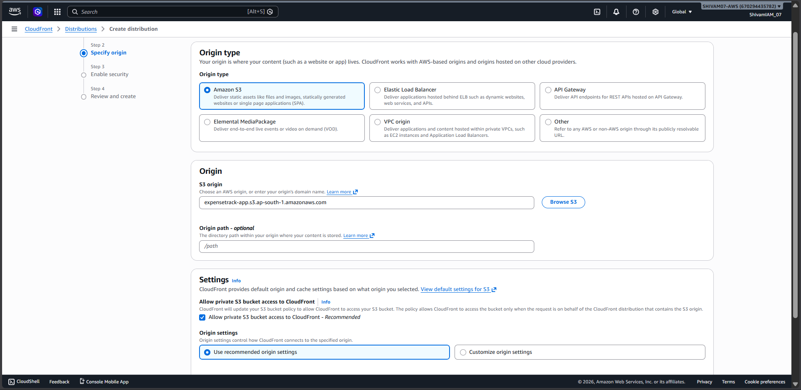
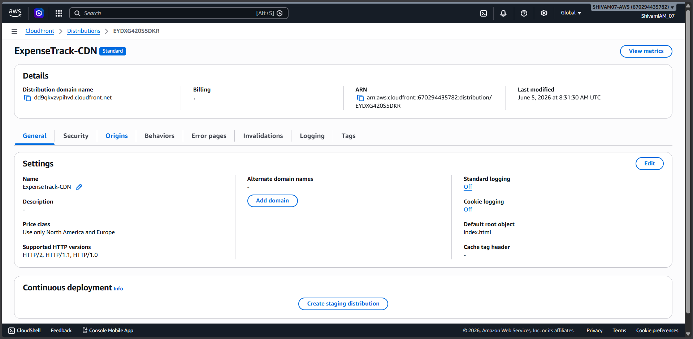

# 💸 Building ExpenseTrack - AWS Serverless Expense Tracker

ExpenseTrack is a fully serverless expense management application built on AWS. In this project, we create a secure expense tracking system where users can register, log in, add expenses, view expenses, update expenses, delete expenses, and manage expense categories.

This project uses Amazon Cognito for authentication, Amazon API Gateway HTTP API for API management, AWS Lambda for backend logic, Amazon DynamoDB for database storage, Amazon S3 for frontend hosting, and Amazon CloudFront for secure content delivery.

---

# 📌 Project Overview

ExpenseTrack is designed as a cloud-native serverless application.

When a user opens the website, CloudFront serves the frontend files from an S3 bucket. The user authenticates through Amazon Cognito. After login, Cognito provides a JWT token. The frontend sends this token with API requests. API Gateway validates the token using a JWT Authorizer and forwards valid requests to Lambda functions. Lambda functions then interact with DynamoDB and return the response back to the frontend.

---

# 🏗️ Architecture Flow

```text
User Browser
     |
     v
Amazon CloudFront
     |
     v
Amazon S3 Static Website
     |
     v
Amazon Cognito Authentication
     |
     v
Amazon API Gateway HTTP API
     |
     v
AWS Lambda Functions
     |
     v
Amazon DynamoDB
```

---

# 📸 Architecture Diagram

<p align="center">
  
</p>

```text
Screenshots/1.AWS-Architecture.png
```
---

# 🧰 AWS Services Used

|     AWS Service    |                   Purpose                                |
|------------------- |----------------------------------------------------------|
| Amazon Cognito     | User registration, login, logout, and JWT authentication |
| Amazon API Gateway | Exposes secured HTTP API endpoints                       |
| AWS Lambda         | Runs backend business logic                              |
| Amazon DynamoDB    | Stores expenses and categories                           |
| Amazon S3          | Hosts frontend static files                              |
| Amazon CloudFront  | Provides CDN, HTTPS, and secure delivery                 |
| AWS IAM            | Provides secure service permissions                      |
| Amazon CloudWatch  | Stores logs for debugging and monitoring                 |

---

# Step 1: Create Amazon Cognito User Pool

Amazon Cognito is used to manage user authentication and authorization.

It handles:

- User Registration
- User Login
- User Logout
- Token Generation
- Session Management

## Create User Pool

Open:

```text
https://console.aws.amazon.com/cognito/
```

Click:

```text
Create User Pool
```
```text
Select Single Page Application
& give It A name
```

Configure:

```text
Sign-in Options:
Email
& Enable Self-Sign in Option
```
Create the User Pool.

Save:
```text
User Pool ID & Client ID
```

### Screenshot

<p align="center">
  
</p>

<p align="center">
  
</p>

<p align="center">
  
</p>

```text
Screenshots/2.cognito-user-pool.png
```

---

# Step 2: Create Cognito App Client

The App Client allows the frontend application to communicate with Cognito.

## Configure App Client

OAuth Flow:
```text
Authorization Code Grant
```

OAuth Scopes:

```text
openid
email
profile
```

Callback URL:

```text
https://your-cloudfront-domain.cloudfront.net
```

Logout URL:

```text
https://your-cloudfront-domain.cloudfront.net
```
CallBack & Logout Url's will be added after creating Cloudfront Distribution

Save:
```text
Cognito Domain
```

### Screenshot

<p align="center">
  
</p>

```text
Screenshots/3.cognito-app-client.png
```

---

# Step 3: Create DynamoDB Tables

ExpenseTrack uses two DynamoDB tables.

## Expenses Table

Table Name:
```text
Expenses
```

Partition Key:

```text
userId
```

Sort Key:

```text
expenseId
```

Example Item:

```json
{
  "userId": "abc123",
  "expenseId": "exp001",
  "Tittle": "Lunch",
  "amount": 500,
  "category": "Food",
  "date": "2026-06-01"
}
```

### Screenshot

<p align="center">
  
</p>

```text
Screenshots/dynamodb-expenses.png
```

---

## Categories Table

Table Name:

```text
Categories
```

Partition Key:

```text
userId
```

Sort Key:

```text
categoryName
```

Example Item:

```json
{
  "userId": "abc123",
  "categoryName": "Lonavala Trip"
}
```

### Screenshot
<p align="center">
  
</p>

```text
Screenshots/dynamodb-categories.png
```

---

# Step 4: Create Lambda Functions

AWS Lambda is used as the backend compute layer.

## Lambda Functions
Each Lambda function performs a dedicated task.

### Expense Operations

```text
addExpense.py
getExpenses.py
updateExpense.py
deleteExpense.py
```

### Category Operations

```text
addCategory.py
getCategories.py
deleteCategory.py
```

### IAM Permissions Required
lambda-expense-role:
```text
dynamodb:PutItem
dynamodb:GetItem
dynamodb:Query
dynamodb:UpdateItem
dynamodb:DeleteItem
dynamodb:Scan
```
## Create Function

open:
```text
https://ap-south-1.console.aws.amazon.com/lambda
```
Click
```text
Create Function → Author from scratch → Enter Function Name & choose Runtime (Language)
→ in Additional setting enable Custom execution role and select lambda-expense-role → Create Function
```
```text
after Lambda Function Creation Update the default lambda code in Code Source with our Code → Deploy
```
```md
## Lambda Function Source Code

The source code for all Lambda functions is included in this repository for reference and deployment purposes.

Location:

```text
code/lambda/
```

### Screenshot
<p align="center">
  
</p>

<p align="center">
  
</p>

<p align="center">
  
</p>

<p align="center">
  
</p>

```text
Screenshots/lambda-functions.png
```

---

# Step 5: Create HTTP API Gateway

An API Gateway is used to define a single, centralized entry point that manages, secures, and routes traffic between client applications and backend Services. 
Instead of forcing a client to communicate directly with dozens of separate internal services, the API Gateway acts as a reverse proxy to present a unified API interface.

API Type:
```text
HTTP API
```

Why HTTP API?

- Lower Cost
- Lower Latency
- Native JWT Authorizer Support
- Simpler Configuration

Create API:

<p align="center">
  
</p>

```text
ExpenseTrack-APP
```

---

# Step 6: Create API Routes

## Expense Routes
```text
GET     /expenses
POST    /expenses
PUT     /expenses/{id}
DELETE  /expenses/{id}
```

## Category Routes
```text
GET     /categories
POST    /categories
DELETE  /categories/{name}
```

### Screenshot

<p align="center">
  
</p>

```text
Screenshots/api-routes.png
```

---

# Step 7: Create Lambda Integrations

Attach the appropriate Lambda function to each API route.

| Method |        Route       |     Lambda     | 
|--------|--------------------|----------------|
| GET    | /expenses          | getExpenses    |
| POST   | /expenses          | addExpense     |
| PUT    | /expenses/{id}     | updateExpense  |
| DELETE | /expenses/{id}     | deleteExpense  |
| GET    | /categories        | getCategories  |
| POST   | /categories        | addCategory    |
| DELETE | /categories/{name} | deleteCategory |

### Screenshot

<p align="center">
  
</p>

```text
Screenshots/api-integrations.png
```

---

# Step 8: Configure JWT Authorizer

JWT Authorizer protects API routes from unauthorized access.

Issuer URL:

```text
https://cognito-idp.<region>.amazonaws.com/<user_pool_id>
```

Audience:

```text
<App Client ID>
```

Attach the JWT Authorizer to all routes.

### Screenshot

<p align="center">
  
</p>

 <p align="center">
      
</p>
```text
Screenshots/jwt-authorizer.png
```

---

# Step 9: Configure CORS

Allowed Origins:

```text
https://your-cloudfront-domain.cloudfront.net
```

Allowed Headers:

```text
authorization
content-type
```

Allowed Methods:

```text
GET
POST
PUT
DELETE
OPTIONS
```
 
 <p align="center">
      
</p>

```text
Screenshots/Cors.png
```
---

# Step 10: Upload Frontend to Amazon S3

Upload:

```text
index.html
```

 <p align="center">
      
</p>

```text
Screenshots/S3.png
```
---

# Step 11: Create CloudFront Distribution

Use the S3 bucket as the origin.

CloudFront provides:

- HTTPS
- CDN
- Faster Global Delivery

Example URL:

```text
https://your-cloudfront-domain.cloudfront.net
```

### Screenshot

<p align="center">
      
</p>

<p align="center">
      
</p>

<p align="center">
      
</p>

<p align="center">
      
</p>

<p align="center">
      
</p>


```text
Screenshots/cloudfront-distribution.png
```

---

# Step 12: Update Frontend Configuration

Update the following values inside the application:

Example:

```javascript
const COGNITO_DOMAIN = "https://your-domain.auth.ap-south-1.amazoncognito.com";
const CLIENT_ID = "your-app-client-id";

const REDIRECT_URI = "https://your-cloudfront-domain.cloudfront.net";
const LOGOUT_URI = "https://your-cloudfront-domain.cloudfront.net";

const API_BASE_URL = "https://your-api-id.execute-api.ap-south-1.amazonaws.com";
```

<p align="center">
      
</p>

---

# Step 13: Test the Application

Open:

```text
https://your-cloudfront-domain.cloudfront.net
```

Test:

1. User Registration
2. User Login
3. Add Expense
4. View Expense
5. Update Expense
6. Delete Expense
7. Add Category
8. Delete Category
9. Logout

---

# Step 14: Verify DynamoDB Records

Verify that data is being stored correctly.

Check:

```text
Expenses Table
Categories Table
```

Ensure that records are stored using:

```text
Cognito User ID (sub claim)
```

---

# 🛠️ Challenges Faced

## User Data Isolation

### Challenge

Ensuring users cannot access each other's expenses.

### Solution

Used Cognito User ID (`sub`) as DynamoDB Partition Key.

---


# 💰 Cost Optimization

Serverless architecture minimizes infrastructure cost.

Services Used:

- AWS Lambda
- API Gateway HTTP API
- DynamoDB
- Amazon Cognito
- Amazon S3
- Amazon CloudFront

Benefits:

- No EC2 Instances
- No Load Balancers
- No Server Maintenance
- Pay-per-Use Pricing
- Automatic Scaling

---

# 🎯 Learning Outcomes

This project demonstrates hands-on experience with:

- Amazon Cognito
- JWT Authentication
- API Gateway HTTP APIs
- AWS Lambda
- Amazon DynamoDB
- Amazon S3
- Amazon CloudFront
- AWS IAM
- Amazon CloudWatch
- Serverless Architecture
- Secure API Design
- Cloud-Native Application Development

---

# 👨‍💻 Author

## Shivam Ekale

AWS Certified Solutions Architect – Associate

Cloud & DevOps Engineer

### Connect With Me

- GitHub: https://github.com/Its-Shiivam22
- LinkedIn: https://www.linkedin.com/in/shiivam22
- Email: shivamekale07@gmail.com

---

# ⭐ Support

If you found this project helpful, consider giving it a ⭐ on GitHub.

It helps others discover the project and supports future improvements.
