# 💸 ExpenseTrack AWS Serverless Expense Tracker


---

## 📌 Project Overview

ExpenseTrack is a fully serverless expense management application built on AWS.

The application allows users to register, log in, add expenses, view expenses, update expenses, delete expenses, and manage custom categories. It uses Amazon Cognito for authentication, API Gateway HTTP API for API routing, AWS Lambda for backend logic, DynamoDB for database storage, S3 for static website hosting, and CloudFront for secure content delivery.

This project demonstrates a complete cloud-native serverless application using managed AWS services.

---

## 🏗️ Architecture Flow

```text
User Browser
     |
     v
Amazon CloudFront
     |
     v
Amazon S3 Static Website
     |
     v
Amazon Cognito Authentication
     |
     v
Amazon API Gateway HTTP API
     |
     v
AWS Lambda Functions
     |
     v
Amazon DynamoDB
```

---

## 🧭 Architecture Diagram using Mermaid

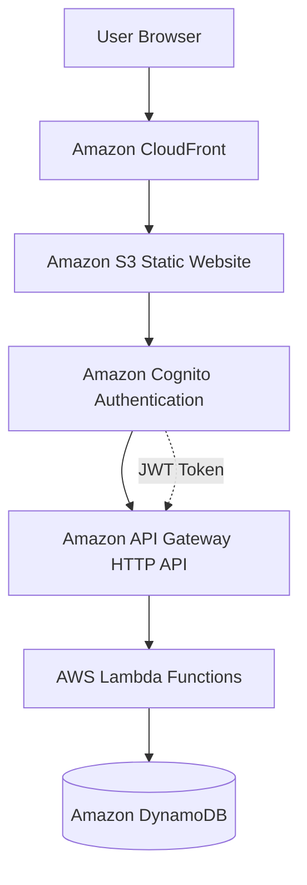

---

## 🔄 Application Request Flow

```text
User Opens ExpenseTrack Website
        |
        v
CloudFront Serves Frontend from S3
        |
        v
User Logs in using Cognito Hosted UI
        |
        v
Cognito Returns JWT Token
        |
        v
Frontend Sends API Request with JWT Token
        |
        v
API Gateway Validates Token using JWT Authorizer
        |
        v
API Gateway Invokes Lambda Function
        |
        v
Lambda Reads/Writes Data in DynamoDB
        |
        v
Response is Returned to Frontend
```

---

## 📸 Architecture Diagram

<p align="center">
  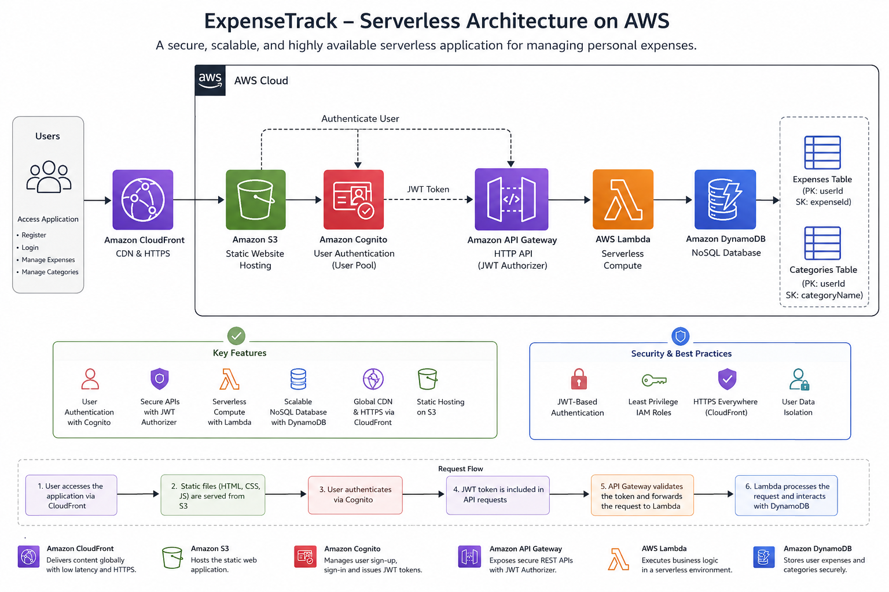
</p>

```text
Screenshots/1.AWS-Architecture.png
```

---

## 🧰 AWS Services Used

| AWS Service | Purpose |
|---|---|
| Amazon Cognito | User registration, login, logout, and JWT authentication |
| Amazon API Gateway | Exposes secured HTTP API endpoints |
| AWS Lambda | Runs backend business logic |
| Amazon DynamoDB | Stores expenses and categories |
| Amazon S3 | Hosts frontend static files |
| Amazon CloudFront | Provides CDN, HTTPS, and secure content delivery |
| AWS IAM | Provides secure service permissions |
| Amazon CloudWatch | Stores logs for debugging |

---

## 📁 Project Structure

```text
ExpenseTrack-AWS-Serverless-Expense-Tracker/
│
├── code/
│   └── lambda/
│       ├── addExpense.py
│       ├── getExpenses.py
│       ├── updateExpense.py
│       ├── deleteExpense.py
│       ├── addCategory.py
│       ├── getCategories.py
│       └── deleteCategory.py
│
├── frontend/
│   └── index.html
│
├── Screenshots/
├── README.md
├── LICENSE
└── .gitignore
```

---

# 📌 Part 1: Amazon Cognito Authentication

## 🔐 Cognito Overview

Amazon Cognito is used to manage authentication and authorization for the application.

Cognito handles:

```text
User Registration
User Login
User Logout
JWT Token Generation
Session Management
```

---

## 🔹 Create Cognito User Pool

Open:

```text
https://console.aws.amazon.com/cognito/
```

Create a new user pool:

```text
Create User Pool
Select Single Page Application
Enable Email Sign-in
Enable Self Sign-up
Create User Pool
```

Save:

```text
User Pool ID
Client ID
```

### Screenshot

<p align="center">
  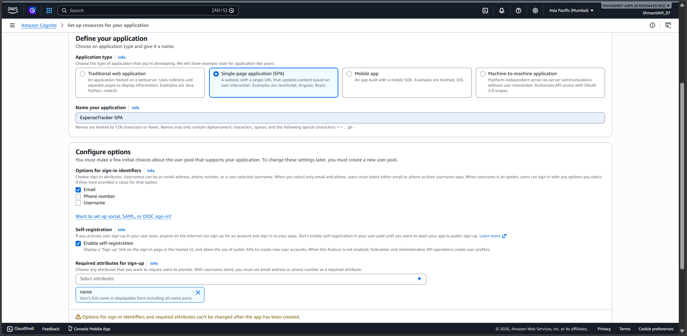
</p>

<p align="center">
  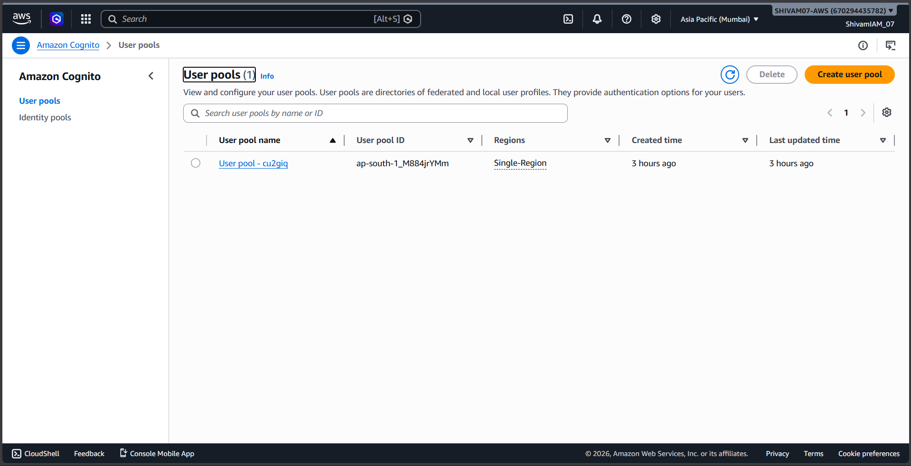
</p>

<p align="center">
  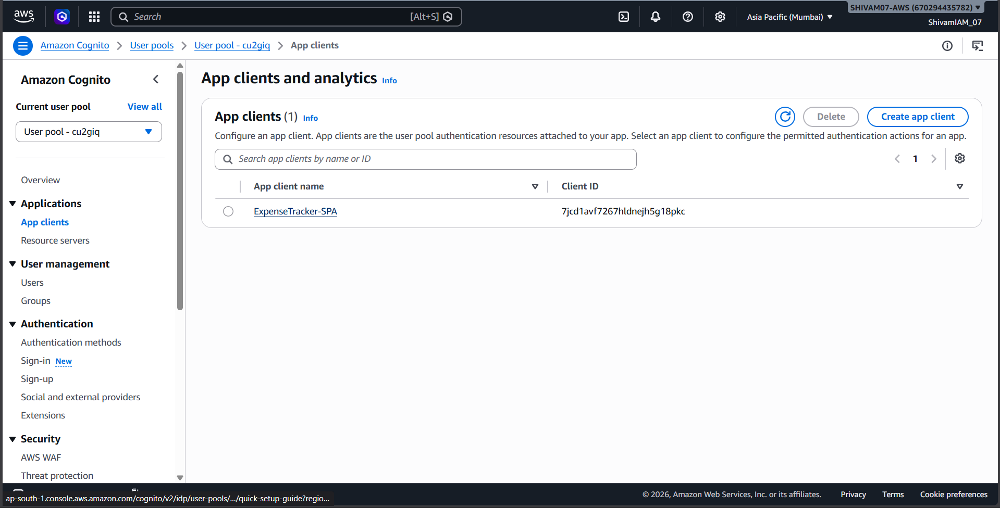
</p>

---

## 🔹 Configure App Client

OAuth flow:

```text
Authorization Code Grant
```

OAuth scopes:

```text
openid
email
profile
```

Callback URL:

```text
https://your-cloudfront-domain.cloudfront.net
```

Logout URL:

```text
https://your-cloudfront-domain.cloudfront.net
```

Save:

```text
Cognito Domain
App Client ID
```

### Screenshot

<p align="center">
  
</p>

---

# 📌 Part 2: DynamoDB Database Setup

## 🗄️ Database Overview

ExpenseTrack uses DynamoDB to store user-specific expenses and categories.

Two tables are used:

```text
Expenses
Categories
```

---

## 🔹 Expenses Table

Table name:

```text
Expenses
```

Keys:

```text
Partition Key: userId
Sort Key: expenseId
```

Example item:

```json
{
  "userId": "abc123",
  "expenseId": "exp001",
  "title": "Lunch",
  "amount": 500,
  "category": "Food",
  "date": "2026-06-01"
}
```

### Screenshot

<p align="center">
  
</p>

---

## 🔹 Categories Table

Table name:

```text
Categories
```

Keys:

```text
Partition Key: userId
Sort Key: categoryName
```

Example item:

```json
{
  "userId": "abc123",
  "categoryName": "Travel"
}
```

### Screenshot

<p align="center">
  
</p>

---

# 📌 Part 3: Lambda Backend Functions

## ⚙️ Lambda Overview

AWS Lambda is used as the backend compute layer.

Each Lambda function performs a specific task.

---

## 🔹 Lambda Functions

Expense operations:

```text
addExpense.py
getExpenses.py
updateExpense.py
deleteExpense.py
```

Category operations:

```text
addCategory.py
getCategories.py
deleteCategory.py
```

---

## 🔹 IAM Permissions Required

The Lambda execution role requires DynamoDB permissions:

```text
dynamodb:PutItem
dynamodb:GetItem
dynamodb:Query
dynamodb:UpdateItem
dynamodb:DeleteItem
dynamodb:Scan
```

---

## 🔹 Create Lambda Function

Open:

```text
https://ap-south-1.console.aws.amazon.com/lambda
```

Steps:

```text
Create Function
Author from scratch
Enter Function Name
Choose Runtime
Select Lambda execution role
Create Function
Update code
Deploy
```

### Screenshot

<p align="center">
  
</p>

<p align="center">
  
</p>

---

# 📌 Part 4: API Gateway HTTP API

## 🌐 API Gateway Overview

Amazon API Gateway acts as a central entry point for frontend API requests.

HTTP API is used because it provides:

```text
Lower cost
Lower latency
JWT Authorizer support
Simpler configuration
```

---

## 🔹 Create HTTP API

Open API Gateway Console:

```text
https://console.aws.amazon.com/apigateway/
```

Create:

```text
HTTP API
API Name: ExpenseTrack-APP
```

### Screenshot

<p align="center">
  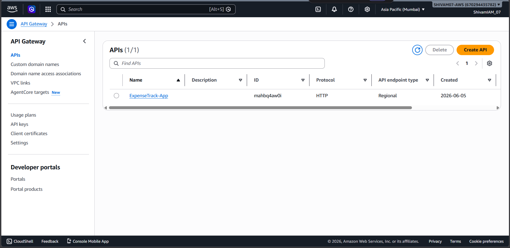
</p>

---

## 🔹 API Routes

Expense routes:

```text
GET     /expenses
POST    /expenses
PUT     /expenses/{id}
DELETE  /expenses/{id}
```

Category routes:

```text
GET     /categories
POST    /categories
DELETE  /categories/{name}
```

### Screenshot

<p align="center">
  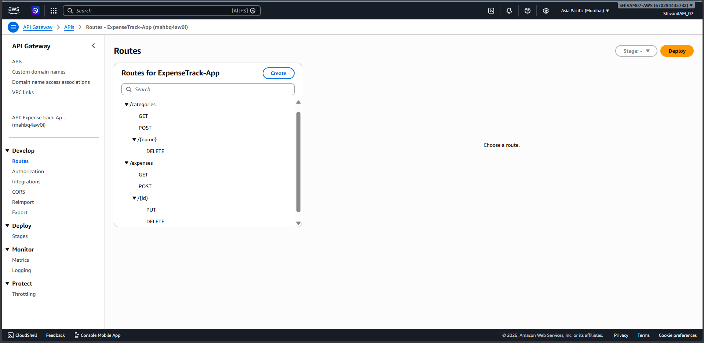
</p>

---

## 🔹 Lambda Integrations

| Method | Route | Lambda Function |
|---|---|---|
| GET | `/expenses` | `getExpenses` |
| POST | `/expenses` | `addExpense` |
| PUT | `/expenses/{id}` | `updateExpense` |
| DELETE | `/expenses/{id}` | `deleteExpense` |
| GET | `/categories` | `getCategories` |
| POST | `/categories` | `addCategory` |
| DELETE | `/categories/{name}` | `deleteCategory` |

### Screenshot

<p align="center">
  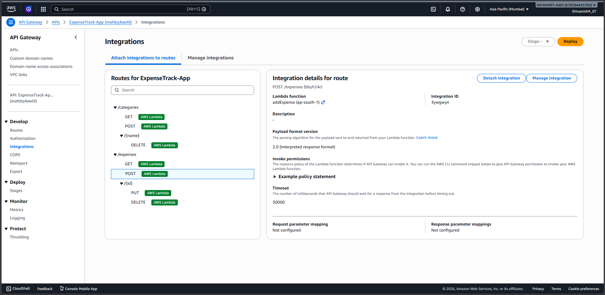
</p>

---

# 📌 Part 5: JWT Authorizer and CORS

## 🔐 JWT Authorizer

JWT Authorizer validates Cognito tokens before allowing API access.

Issuer URL:

```text
https://cognito-idp.<region>.amazonaws.com/<user_pool_id>
```

Audience:

```text
<App Client ID>
```

Attach the authorizer to all protected routes.

### Screenshot

<p align="center">
  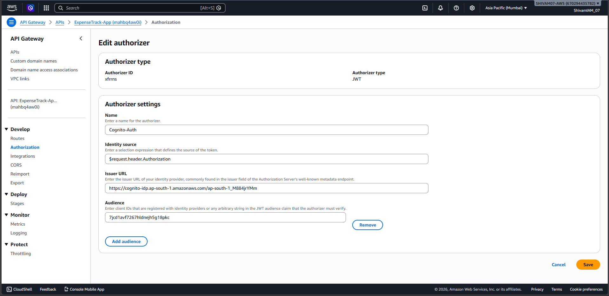
</p>

<p align="center">
  
</p>

---

## 🔹 CORS Configuration

Allowed origin:

```text
https://your-cloudfront-domain.cloudfront.net
```

Allowed headers:

```text
authorization
content-type
```

Allowed methods:

```text
GET
POST
PUT
DELETE
OPTIONS
```

### Screenshot

<p align="center">
  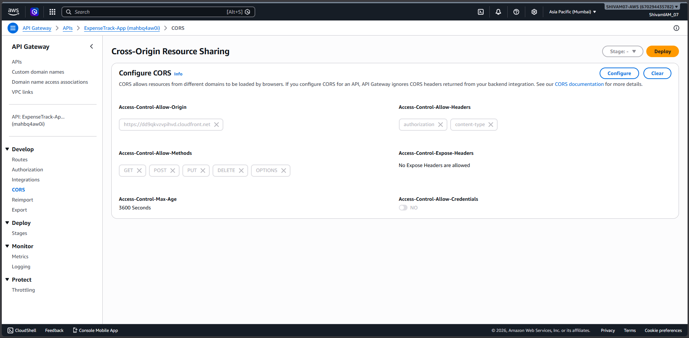
</p>

---

# 📌 Part 6: Frontend Hosting with S3 and CloudFront

## 🌐 Frontend Overview

The frontend is a static web application hosted on Amazon S3 and delivered securely through Amazon CloudFront.

---

## 🔹 Upload Frontend to S3

Upload:

```text
index.html
```

### Screenshot

<p align="center">
  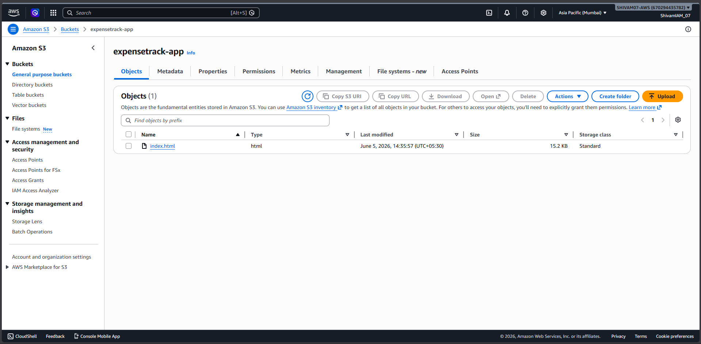
</p>

---

## 🔹 Create CloudFront Distribution

CloudFront provides:

```text
HTTPS
CDN
Caching
Secure frontend delivery
```

Use the S3 bucket as the origin.

Example URL:

```text
https://your-cloudfront-domain.cloudfront.net
```

### Screenshot

<p align="center">
  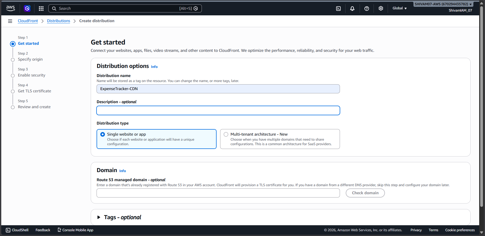
</p>

<p align="center">
  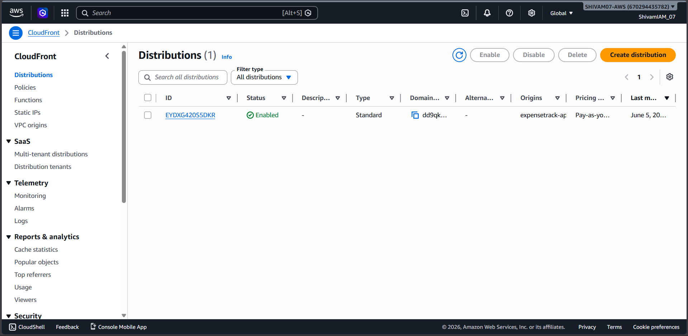
</p>

---

# 📌 Part 7: Frontend Configuration

Update frontend configuration values:

```javascript
const COGNITO_DOMAIN = "https://your-domain.auth.ap-south-1.amazoncognito.com";
const CLIENT_ID = "your-app-client-id";

const REDIRECT_URI = "https://your-cloudfront-domain.cloudfront.net";
const LOGOUT_URI = "https://your-cloudfront-domain.cloudfront.net";

const API_BASE_URL = "https://your-api-id.execute-api.ap-south-1.amazonaws.com";
```

### Screenshot

<p align="center">
  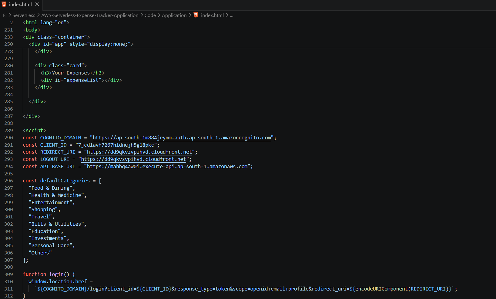
</p>

---

# 📌 Part 8: Application Testing

## ✅ Test Authentication

Open CloudFront URL:

```text
https://your-cloudfront-domain.cloudfront.net
```

Click login and authenticate using Cognito Hosted UI.

---

## ✅ Test API Gateway

Test protected routes after login:

```text
GET /expenses
POST /expenses
GET /categories
POST /categories
```

---

## ✅ Test DynamoDB Data

Verify that expenses and categories are stored under the logged-in user's ID.

---

# 🎥 Application Demo Video

This video demonstrates the working deployment of **ExpenseTrack**, including user authentication, JWT authorization, expense management, category management, API Gateway integration, Lambda backend processing, DynamoDB storage, S3 hosting, and CloudFront delivery.

<p align="center">
  <a href="https://youtu.be/6Iom2RHtXs8">
    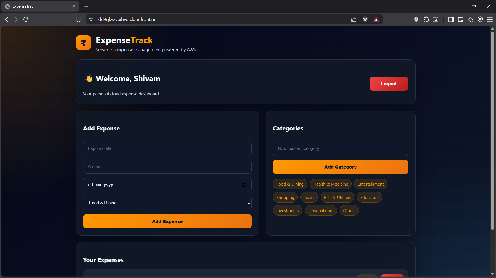
  </a>
</p>

<h4 align="center">📌 Click on the image above to watch the full demo on YouTube.</h4>

---

## 🖼️ Screenshots

<p align="center">
  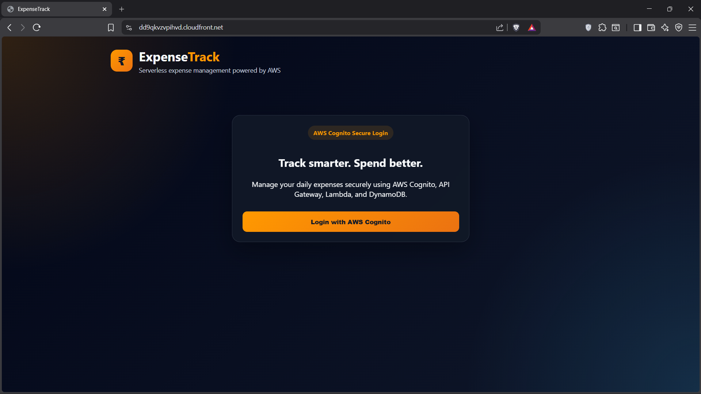
</p>

<p align="center">
  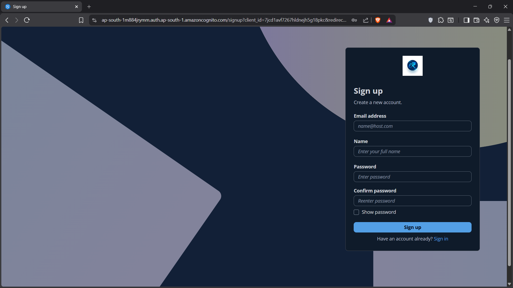
</p>

<p align="center">
  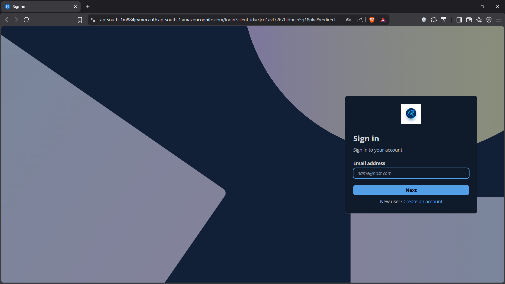
</p>

<p align="center">
  
</p>

<p align="center">
  
</p>

<p align="center">
  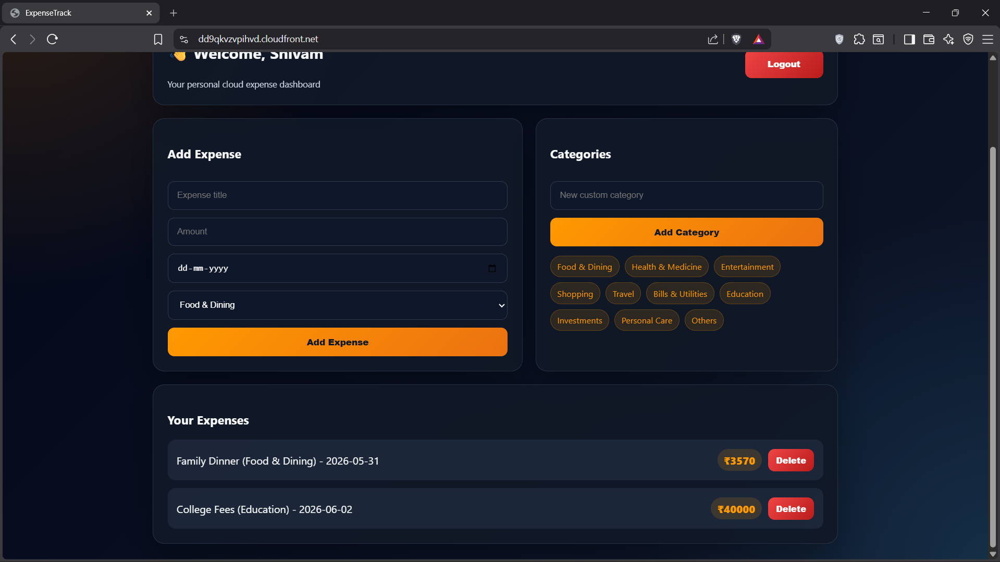
</p>

---

# 🛠️ Challenges Faced

## 1. User Data Isolation

### Challenge

Users should not be able to access each other's expenses.

### Solution

Used Cognito user ID as the DynamoDB partition key.

---

## 2. JWT Authorization

### Challenge

API routes needed to be protected from unauthorized users.

### Solution

Configured API Gateway JWT Authorizer using Cognito issuer URL and App Client ID.

---

## 3. CORS Errors

### Challenge

Frontend requests were blocked due to incorrect CORS configuration.

### Solution

Configured allowed origins, headers, and methods correctly in API Gateway.

---

## 4. Frontend and Cognito Redirect URLs

### Challenge

Cognito login failed when callback and logout URLs did not match CloudFront URL.

### Solution

Updated Cognito App Client callback and logout URLs with the final CloudFront domain.

---

# 💰 Cost Optimization

Serverless architecture helps reduce cost because resources scale automatically and there is no server management.

Cost optimization benefits:

```text
No EC2 instances
No Load Balancers
No server maintenance
Pay-per-use pricing
Automatic scaling
```

AWS services used:

```text
AWS Lambda
API Gateway HTTP API
DynamoDB
Amazon Cognito
Amazon S3
Amazon CloudFront
CloudWatch Logs
```

---

# 🎯 Learning Outcomes

This project demonstrates hands-on experience with:

- Amazon Cognito authentication
- Cognito Hosted UI
- JWT token-based authorization
- API Gateway HTTP API
- Lambda backend functions
- DynamoDB data modeling
- S3 static website hosting
- CloudFront secure delivery
- IAM role permissions
- CORS troubleshooting
- User-based data isolation
- Serverless application architecture
- Cloud-native application development

---

# 🧹 Cleanup

To avoid unnecessary AWS billing:

```text
Delete CloudFront distribution
Delete S3 bucket files
Delete API Gateway HTTP API
Delete Lambda functions
Delete DynamoDB tables
Delete Cognito User Pool
Delete IAM roles created for Lambda
Review CloudWatch logs
```

---

# 📜 License

This project is licensed under the **MIT License**.

---

# 👨‍💻 Author

## Shivam Ekale

AWS Certified Solutions Architect – Associate  
Cloud & DevOps Engineer

### Connect With Me

- GitHub: https://github.com/Its-Shiivam22
- LinkedIn: https://www.linkedin.com/in/shiivam22
- Portfolio: https://www.shivamekale.in
- Email: shivamekale07@gmail.com

---

# ⭐ Support

If you found this project helpful, consider giving it a ⭐ on GitHub.
